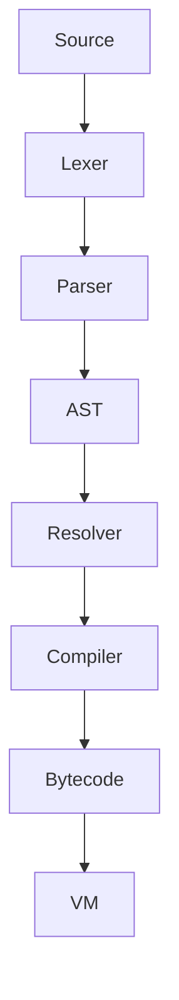

# TofuScript

A small, experimental bytecode-based scripting language implemented in Zig 0.14.0. This repository currently provides a lexer, parser, bytecode compiler, and a simple stack-based VM with native interop.

Status: early prototype (WIP). The README reflects current capabilities and a concrete plan to reach a performant, production-ready language.

## Quick start

Prerequisites: Zig 0.14.0+

Build and run:

```bash
zig build
zig build run
zig build test
```

Minimal program supported today:

```txt
func main() {
  var x = 10;
  var y = 20;
  print(x + y);
}

main();
```

## Tracing and disassembly

Structured tracing is available behind a compile-time flag. When enabled, the VM, compiler, and bytecode layers emit concise, structured logs, and the main program disassembles the compiled chunk.

Enable tracing:
```bash
zig build -Dtrace=true run
```

What you get when tracing is enabled:
- VM step trace: instruction pointer and opcode logs via [trace.log()](src/trace.zig:7)
- Compiler and bytecode events (e.g., constants added/emitted)
- Disassembly output from [Chunk.disassemble()](src/bytecode.zig:73) gated in [main()](src/main.zig:19)
## Current capabilities (truthful)

Language and parser:
- Functions: declaration with name and parameters; calls with up to 255 args.
- Variables: global var declarations with optional initializer; assignment to identifiers.
- Blocks: lexical blocks with braces.
- Expressions: literals (number, string, bool, nil), + - * /, == < >, grouping, calls, identifiers.
- Print: print statement desugared to a function call.
- Imports: recognized syntax; currently ignored by the compiler.
- Not yet implemented: if/else, while/for, return, logical and/or, proper unary nodes, error recovery.

Compiler and bytecode:
- Emits stack-oriented bytecode with short and long constant forms.
- Globals only: get_global, set_global, define_global; no locals or closures yet.
- Function objects with arity; calls and returns.
- Opcodes implemented: constant, constant_long, get_global, set_global, define_global, add, subtract, multiply, divide, negate, equal, greater, less, jump, jump_if_false, loop, call, return, print, pop, nil, true, false, not.

Virtual machine:
- Stack-based VM with call frames, simple bounds checks, and native function interop (e.g., print).
- Values: number, boolean, nil, string object, function object, native function object.
- Strings support concatenation; interning is not yet implemented.

Codebase layout:
- [src/lexer.zig](src/lexer.zig)
- [src/tokens.zig](src/tokens.zig)
- [src/parser.zig](src/parser.zig)
- [src/ast.zig](src/ast.zig)
- [src/compiler.zig](src/compiler.zig)
- [src/bytecode.zig](src/bytecode.zig)
- [src/value.zig](src/value.zig)
- [src/vm.zig](src/vm.zig)
- [src/main.zig](src/main.zig)

## Architecture

TofuScript follows a traditional pipeline:

```
Source → Lexer → Parser → AST → Compiler → Bytecode → VM
```

Where we are headed:
- Insert Resolver between Parser and Compiler to bind identifiers, manage locals/upvalues, and support closures.
- Introduce precise GC and central allocator for all heap objects.
- Add module loader before compilation for multi-file programs.

Mermaid overview:



## Roadmap to 1.0

Phase 0 (COMPLETE) — Stabilize the prototype:
- Replace debug prints with structured tracing behind a compile-time flag.
- Improve error messages and add parser error synchronization.
- Add disassembler improvements for bytecode debugging.

Phase 1 — Language completeness (MVP):
- Statements: if/else, while, for, return, break/continue.
- Operators: logical and/or, proper unary nodes.
- Parser recovery: synchronize on ; and braces to continue after errors.

Phase 2 — Scoping and closures:
- Implement Resolver: scopes, locals, parameters-as-locals, shadowing rules.
- VM opcodes: LOAD_LOCAL, STORE_LOCAL, OP_CLOSURE, OP_GET_UPVALUE, OP_SET_UPVALUE.
- Closure objects and upvalue capture semantics.

Phase 3 — Runtime and memory:
- Central allocator for all heap objects.
- Precise mark-sweep GC with root set (stack, globals, frames), write barriers, and stress tests.
- String interning and rope/arena strategy for concat-heavy workloads.

Phase 4 — Collections and standard library MVP:
- Arrays: NEW_ARRAY, GET_INDEX, SET_INDEX; iterators.
- Maps: NEW_MAP, GET_KEY, SET_KEY; hashing for strings and numbers.
- stdlib: io, os, math, string, array, map, fmt.

Phase 5 — Tooling and UX:
- REPL with line editing, multi-line input, and error reporting.
- Module system: file-based loader, search paths, module cache.
- Debugger hooks: breakpoints, step, stack traces, value inspection.

Phase 6 — Optimization and releases:
- Compiler: constant folding, dead-code elimination for blocks, peephole pass.
- VM: inline caches for globals and calls, superinstructions for hot opcode pairs, fast paths for numbers.
- Cross-platform CI and prebuilt binaries for Windows/macOS/Linux.

## Performance plan

Short term (unlock obvious wins):
- Remove per-step debug printing in non-debug builds; add a trace opcode flag.
- Bounds-check elision in hot paths with assertions in Debug, checks in ReleaseSafe.
- Value representation: ensure numbers use unboxed f64; consider NaN-tagging as a later optimization.
- String interning table to remove duplicate allocations and speed equality.

Medium term (algorithmic improvements):
- Introduce inline caches for get_global and set_global, and monomorphic call sites.
- Add superinstructions for common pairs like load-constant; call; return and arithmetic chains.
- Improve constant pool layout and constant_long emission to be branchless.
- Basic block formation in compiler to aid peephole optimizer.

Long term (memory and locality):
- Precise GC with generational nursery; bump allocation for short-lived objects.
- Allocate frames and stacks in contiguous arenas to improve cache locality.
- Consider optional register-based VM variant behind build flag, measured by benchmarks.

Benchmarking strategy:
- Micro: arithmetic, string concat, function call overhead, map/array ops once implemented.
- Macro: Fibonacci, JSON decode/encode (post-stdlib), regex-lite workloads if added later.
- Harness: run in zig build benchmark with warmup, median-of-N, CI thresholds to prevent regressions.

## Testing and CI

- Unit tests per component; add golden tests for lexer/parser and VM traces.
- End-to-end tests from source to output for small programs.
- GitHub Actions: build, test, format, and run benchmarks on push/PR across platforms.

## Contributing

Contributions are welcome. Good first issues will be labeled as we break work into small tasks. Please discuss larger changes in issues first.

## License

MIT License. See LICENSE.